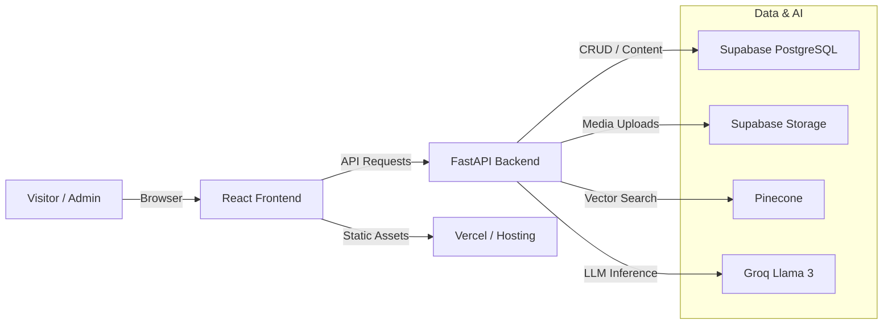
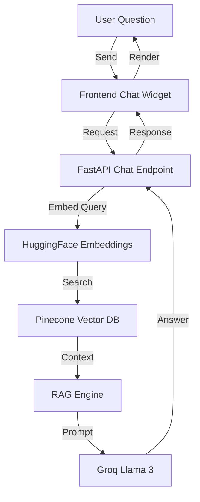

# Sandip Gupta — AI Portfolio Website

[](https://sandipgupta.is-a.dev)
[](https://reactjs.org/)
[](https://fastapi.tiangolo.com/)
[](https://groq.com/)

A polished, professional portfolio for an **AI Engineer & Master Trainer**. This full-stack project combines a modern frontend, a secure admin dashboard, and an AI-powered chatbot.

---

## ✨ Project Overview

This repository showcases a complete personal branding website with a strong focus on AI, frontend polish, and backend manageability.

- Responsive public portfolio with sections for about, skills, projects, experience, and contact.
- Admin dashboard for managing portfolio content, media, and inquiries.
- Retrieval-Augmented Generation (RAG) chatbot that answers questions from site data.
- Full-stack architecture engineered for deployment and scalability.

---

## 🚀 Key Features

### AI Portfolio Chatbot
- Context-aware responses using **Pinecone** and **Groq Llama 3**.
- Intelligent answers powered by portfolio content, project details, and professional expertise.
- Streamlined chat experience built for visitors and recruiters.

### Admin Dashboard
- Secure admin area with JWT-based authentication.
- Manage projects, achievements, courses, tech stack, and contact leads.
- Upload media assets using **Supabase Storage**.

### Frontend Experience
- Built with **React + Vite** for speed and developer productivity.
- Modern responsive design with smooth animations and subtle transitions.
- Clean navigation, mobile-friendly menu, and section-based scrolling.

### Backend Architecture
- **FastAPI** REST API powering content and AI endpoints.
- **Supabase PostgreSQL** for data storage and auth.
- Robust API structure for scalable content delivery.

---

## 🧰 Technology Stack

**Frontend**
- React
- Vite
- Tailwind CSS / Vanilla CSS
- Framer Motion
- Lucide Icons
- React Router

**Backend**
- Python 3
- FastAPI
- Supabase
- JWT Authentication
- Pydantic

**AI & Data**
- Groq Llama 3
- HuggingFace embeddings
- Pinecone vector DB
- Supabase Storage

---

## 🏗️ Architecture Diagrams

### Project Schema



### Chatbot Workflow



---

## 📁 Repository Structure

- `frontend/` — React application with the public portfolio and admin interface.
- `backend/` — FastAPI application serving REST APIs, auth, and AI routes.
- `supabase/` — Supabase schema and migration scripts.
- `plan.txt` — Project notes and roadmap.

---

## ⚙️ Local Setup

### 1. Clone the repository
```bash
git clone https://github.com/GuptaSandip/sandip-portfolio.git
cd sandip-portfolio
```

### 2. Backend setup
```bash
cd backend
python -m venv .venv
.venv\Scripts\Activate.ps1
pip install -r requirements.txt
```

### 3. Frontend setup
```bash
cd ../frontend
npm install
```

### 4. Run locally
```bash
cd ../backend
uvicorn app.main:app --reload --port 8000
```

```bash
cd ../frontend
npm run dev
```

---

## 🌐 Deployment

- Frontend is ready for **Vercel** deployment.
- Backend can be deployed on any FastAPI-compatible host.
- Supabase manages database, auth, and media storage.

---

## 👤 About Sandip Gupta
Sandip is an AI engineer and master trainer building intelligent, production-ready applications for data-driven companies.

- Portfolio: https://sandipgupta.is-a.dev
- LinkedIn: https://www.linkedin.com/in/sandipgupta-ai/

---

## 📄 License
This project is licensed under the MIT License.
