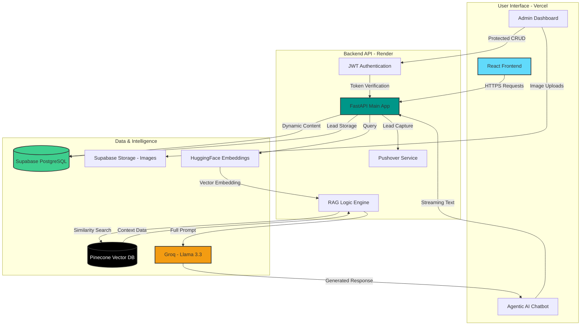
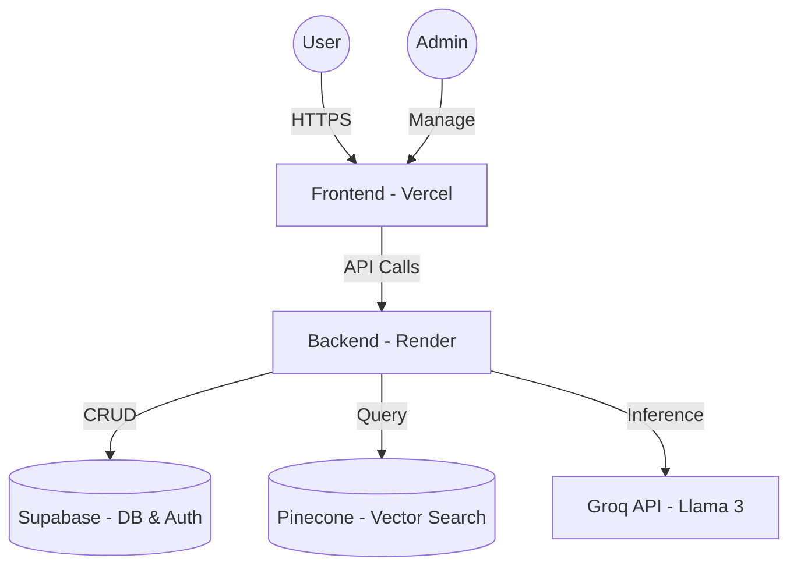

# 🚀 AI-Driven Professional Portfolio | Sandip Gupta

A modern, high-performance full-stack portfolio built for an **AI Engineer & Master Trainer**. This project features a RAG-based AI assistant, a secure administrative control panel, and a dynamic frontend with fluid animations.

---

## ✨ Key Features

### 🤖 Intelligent Agentic AI Assistant (RAG) - Chatbot
- **Engine**: Powered by **Llama 3 (Groq API)** for ultra-fast inference.
- **Context Awareness**: Uses **Pinecone Vector Database** for Retrieval-Augmented Generation (RAG), allowing the AI to answer questions specifically about my work, courses, and technical expertise.
- **Consultative Flow**: Designed to guide users from general curiosity to professional collaboration.

### 🔐 Administrative Control Panel
- **Full CRUD**: Manage projects, tech stack, achievements, and course enrollments in real-time.
- **Media Management**: Integrated with **Supabase Storage** for seamless image and file uploads.
- **Analytics**: Built-in monitoring for leads and user inquiries.

### 🎨 Premium User Experience
- **Fluid UI**: Built with **React** and **Framer Motion** for glassmorphic design and subtle micro-animations.
- **Dynamic Content**: Every section (Bio, Skills, Projects) is synced with the backend via RESTful APIs.
- **SEO Optimized**: Fully responsive design with metadata optimization for search engines.

---

## 🛠️ Tech Stack

### Frontend
- **Framework**: React.js (Vite)
- **Styling**: Tailwind CSS / Vanilla CSS (Modern UI)
- **Animations**: Framer Motion, Lucide Icons
- **State Management**: React Context API & Hooks

### Backend
- **Core**: Python (FastAPI)
- **Database**: Supabase (PostgreSQL)
- **Authentication**: JWT (JSON Web Tokens) with secure password hashing
- **Task Scheduling**: Python-based automation for lead management

### AI / Data Layer
- **LLM**: Meta Llama 3 (via Groq)
- **Embeddings**: HuggingFace Inference API
- **Vector DB**: Pinecone (for RAG storage)
- **Real-time Notifications**: Pushover API integration

---

## 🏗️ Project Architecture

______________________________________________________________________________________________________________________________________________________________________________

### 👨‍💻 About the Author
I am Sandip Gupta, a Master Trainer in Data Science and AI Engineer. I specialize in building end-to-end AI solutions, from custom RAG pipelines to scalable web architectures.

- Portfolio: sandipgupta.is-a.dev
- LinkedIn: sandip-gupta11
- Twitter: @guptasandip11

### 📄 License
This project is MIT licensed. 
Feel free to use it as a template for your own portfolio!
